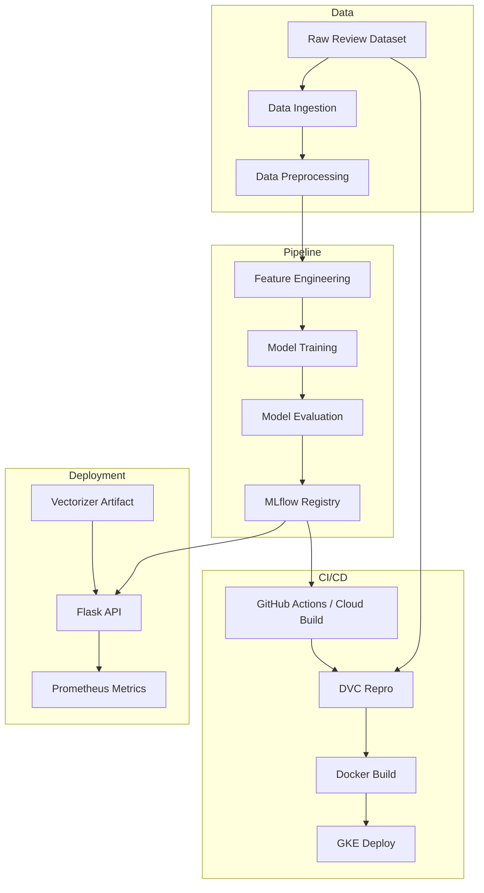

# MLOps Capstone Project

[](https://www.python.org/) [](https://dvc.org/) [](https://mlflow.org/) [](https://www.docker.com/) [](https://kubernetes.io/) [](LICENSE)

## 📖Overview

This repository contains a production-grade MLOps pipeline for sentiment analysis on movie reviews. It demonstrates a complete workflow across data versioning, data preprocessing, feature engineering, model training, experiment tracking, registry management, deployment, and monitoring.

The implementation supports both local development and cloud deployment, and includes reusable artifacts, MLflow model registry integration, DVC pipeline orchestration, Docker containerization, Kubernetes manifests, and Prometheus observability.

## ✨Features

- ✅ End-to-end machine learning lifecycle from raw data to deployment
- ✅ Data versioning and reproducible pipelines using DVC
- ✅ Experiment tracking and model registry using MLflow and DagsHub
- ✅ Text preprocessing with lemmatization and stop-word removal
- ✅ Bag-of-Words feature engineering with configurable vectorization
- ✅ Logistic Regression model training and evaluation
- ✅ Flask inference service with `/predict` and `/metrics` endpoints
- ✅ Prometheus-compatible monitoring and metrics
- ✅ Docker and Kubernetes support for deployment

## 🏗️Architecture Diagram



## ⚙️MLOps Pipeline

Pipeline stages are defined in `dvc.yaml` and include:

- `data_ingestion`

  - Loads raw CSV review data
  - Filters sentiment labels and creates train/test splits
  - Saves raw datasets to `data/raw/`
- `data_preprocessing`

  - Cleans text data
  - Removes URLs, punctuation, numbers, and stop words
  - Applies lemmatization
  - Saves cleaned datasets to `data/interim/`
- `feature_engineering`

  - Builds bag-of-words features with `CountVectorizer`
  - Saves processed datasets to `data/processed/`
  - Persists `models/vectorizer.pkl`
- `model_building`

  - Trains a `LogisticRegression` model
  - Persists `models/model.pkl`
- `model_evaluation`

  - Evaluates model performance on test data
  - Logs metrics to MLflow
  - Writes `reports/metrics.json`
  - Writes `reports/experiment_info.json`
- `model_registration`

  - Registers the model with MLflow Model Registry
  - Applies description, tags, and alias metadata

## ☁️GCP Architecture

This project is designed to support deployment on Google Cloud Platform using GKE.

The architecture includes:

- Docker image build and storage in Artifact Registry
- Kubernetes deployment on GKE
- Flask inference service exposed through a Kubernetes Service
- Prometheus scraping of the `/metrics` endpoint
- Optional ingress or load balancer for external access

Kubernetes manifests are available in `k8s/`.

## 🔄CI/CD Workflow

A recommended CI/CD process includes:

1. **Code validation**

   - Syntax checks with `python -m py_compile`
   - Unit tests with `pytest`
2. **Pipeline reproduction**

   - `dvc repro` to rebuild pipeline stages
   - Optional `dvc push` to sync remote artifacts
3. **Model tracking**

   - Validate MLflow metrics and artifacts
   - Ensure `reports/experiment_info.json` is generated successfully
4. **Containerization**

   - Build Docker image
   - Push image to registry
5. **Deployment**

   - Apply Kubernetes manifests
   - Validate service readiness and endpoints
6. **Monitoring**

   - Confirm Prometheus scraping and metrics availability

## 🛠️Tech Stack

- Python 3.10+
- Flask
- scikit-learn
- pandas, numpy
- NLTK
- MLflow
- DVC
- DagsHub
- Docker
- GCS
- Kubernetes / GKE
- Prometheus client
- GitHub Actions / Cloud Build

## 📂Repository Structure

```text
.
├── dvc.yaml
├── data/
├── docs/
├── flask_app/   	# Flask inference service
├── k8s/ 		# Kubernetes manifests
├── models/		# Saved artifacts
├── notebooks/		# Experiments
├── reports/		# Metrics & experiment info
├── scripts/		# Deployment & automation
├── src/
│   ├── data/
│   ├── features/
│   ├── logger/
│   ├── model/
│   └── visualization/
├── src.egg-info/
├── tests/		# Unit tests
├── Dockerfile
├── params.yaml
├── requirements.txt
├── setup.py
├── test_environment.py
├── LICENSE
├── Makefile
├── README.md
├── mlruns/
└── tox.ini
```

## 🚀Getting Started

### Prerequisites

- Python 3.10 or newer
- Git
- DVC 3.x
- Docker
- `kubectl`
- Optional: Google Cloud SDK and GKE access

### Clone repository

```bash
git clone <repo-url>
cd MLOpsCapstoneProject
```

### Install dependencies

```bash
conda create --name mlopsenv python=3.10 -y
conda activate mlopsenv
pip install -r requirements.txt

# python -m pip install -r requirements.txt
```

### Configure environment variables

```bash
export CAPSTONE_TEST=<dagshub_token>
```

Windows PowerShell:

```powershell
$env:CAPSTONE_TEST = "<dagshub_token>"
```

## 💻Local Development

### Run the DVC pipeline

```bash
dvc repro
```

This executes all pipeline stages and materializes artifacts.

### Run the Flask API

```bash
cd flask_app
python app.py
```

Access the service at:

```text
http://localhost:5000
```

### Validation

```bash
python -m py_compile src/model/model_evaluation.py
python -m py_compile src/model/register_model.py
pytest tests
```
- **you can also set up on docker and run the containerized version of the application.**
## 🐳Docker

### Build image

```bash
docker build -t mlops-capstone:latest .
```

### Run container

```bash
docker run -p 5000:5000 mlops-capstone:latest
```

## ☸️ Deploy to Google Kubernetes Engine (GKE)

### Enable Required APIs

```bash
gcloud services enable \
container.googleapis.com \
artifactregistry.googleapis.com \
compute.googleapis.com \
iam.googleapis.com
```

### Create Artifact Registry

```bash
gcloud artifacts repositories create mlops-repo \
    --repository-format=docker \
    --location=asia-south2 \
    --description="Docker images for MLOps project"
```

### Create a GKE Cluster

Create an Autopilot cluster:

```bash
gcloud container clusters create-auto mlops-cluster \
    --region asia-south2
```
Verify the cluster:

```bash
gcloud container clusters list
```
now you will run you github actions workflow to build and push the docker image to artifact registry and deploy the application to GKE.
```bash
git add .
git commit -m "Deploy to GKE"
git push -u origin main
```

**some common issues you may face while deploying to GKE:**
- The GitHub Actions service account doesn't have enough IAM permissions.
```bash 
gcloud projects add-iam-policy-binding PROJECT_ID \
--member="serviceAccount:SERVICE_ACCOUNT_EMAIL" \
--role="roles/container.developer"
```
- If Kubernetes nodes cannot pull images from Artifact Registry check which service account is used by the cluster and grant it the `roles/artifactregistry.reader` role.
```bash
gcloud container clusters describe mlops-cluster \
--region asia-south2 \
--format="value(nodeConfig.serviceAccount)"
```

- If cluster uses the Compute Engine default service account.
```bash
# find the default service account email
gcloud compute project-info describe \
--format="value(defaultServiceAccount)"

# grant the Artifact Registry Reader role
gcloud artifacts repositories add-iam-policy-binding mlops-repo \
--location=asia-south2 \
--member="serviceAccount:177124743636-compute@developer.gserviceaccount.com" \
--role="roles/artifactregistry.reader"

# Wait 1–2 minutes, then restart the deployment
kubectl rollout restart deployment capstone-app
```

- Verify Deployment
```bash
kubectl get pods
kubectl get svc # to get the external IP of the service
```
- Check Logs
```bash
kubectl logs -f POD_NAME
```

### Port-forward

```bash
kubectl port-forward svc/<service-name> 5000:5000
```

## 📊MLflow & DagsHub

- Remote tracking is enabled through DagsHub when `CAPSTONE_TEST` is configured.
- The project registers models and logs metrics to MLflow.
- If `CAPSTONE_TEST` is absent, the pipeline falls back to a local `mlruns/` directory.

## 📈Monitoring (Prometheus)

The Flask service exposes metrics at:

```text
/metrics
```

Metrics include:

- request count
- request latency
- prediction counts by class

## 🧪Testing

### Run unit tests

```bash
pytest tests
```

### Static checks

```bash
python -m py_compile src/model/model_building.py
python -m py_compile src/model/model_evaluation.py
python -m py_compile flask_app/app.py
```

## 🔮Future Improvements

- Add CI/CD workflow automation via terraform
- Add end-to-end integration tests
- Implement GKE ingress and autoscaling configuration
- Add drift detection and model monitoring
- Enhance feature engineering with embeddings or transformers

## 🤝Contributing

1. Fork the repository
2. Create a feature branch
3. Add tests for new functionality
4. Submit a pull request

## 📄License

MIT
